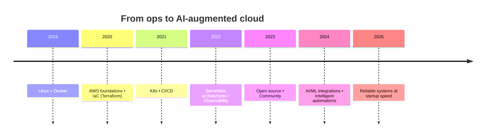

### Mohammed Firdous — Cloud Engineer, AI, Open Source 👋

I design and automate resilient cloud systems. My tools: AWS, Python, Go, Terraform, Docker, Kubernetes. I share what I learn and build in public.

— shipping small, learning fast, and keeping it simple.

## 🧭 Table of Contents

- [About Me](#about-me)
- [Highlights](#-highlights)
- [Featured Projects](#-featured-projects)
- [Latest Blog Posts](#-latest-blog-posts)
- [Tech Stack](#-tech-stack)
- [Communities](#-communities)
- [Recent Activity](#-recent-activity)
- [GitHub Metrics](#-github-metrics)
- [Connect](#-connect)
- [Open to Collaborate](#-open-to-collaborate)

## 👤 About Me

- Serverless architectures on AWS
- Infrastructure as Code with Terraform and Pulumi
- Containers and orchestration with Docker and Kubernetes
- Observability and reliability engineering
- CI/CD and platform automation
- AI-assisted developer workflows

## 🌟 Highlights

  
  
  

— more on my profile and orgs.

---

## 📦 Featured Projects

- [Tranzor](https://github.com/mohammedfirdouss/Tranzor) — Event-driven serverless system for real-time financial transaction processing with strong observability.
- [Cruddur](https://github.com/mohammedfirdouss/aws-bootcamp-cruddur-2023) — Containerized microservices on AWS with end-to-end CI/CD and infrastructure as code.
- [Terra Towns](https://github.com/mohammedfirdouss/terraform-beginner-bootcamp-2023) — Reusable Terraform modules, environment separation, and automated provisioning workflows.

---

## 📬 Connect

---

## 📝 Latest Blog Posts

<!-- BLOG-POST-LIST:START -->
- [MCPs and APIs](https://medium.com/@mohammedfirdousaraoye/mcps-and-apis-6d4d3559da63?source=rss-19706121782c------2)
- [Why a Serverless Mindset Matters](https://medium.com/@mohammedfirdousaraoye/why-a-serverless-mindset-matters-a0103642631a?source=rss-19706121782c------2)
- [Understanding Docker](https://medium.com/@mohammedfirdousaraoye/understanding-docker-fdfc1edf3bbd?source=rss-19706121782c------2)
- [3 Tier Architecture using AWS CloudFormation](https://medium.com/@mohammedfirdousaraoye/3-tier-architecture-using-aws-cloudformation-419044db9587?source=rss-19706121782c------2)
- [Navigating AWS with Confidence: A Beginner’s Guide to Amazon CloudWatch and Amazon Route 53](https://medium.com/@mohammedfirdousaraoye/navigating-aws-with-confidence-a-beginners-guide-to-amazon-cloudwatch-and-amazon-route-53-38e1225cf0f0?source=rss-19706121782c------2)
<!-- BLOG-POST-LIST:END -->

---

## 🛠️ Tech Stack

---

## 🎖️ Communities

---

## 🤝 Open to Collaborate

Let’s build something impactful. [Connect on LinkedIn](https://www.linkedin.com/in/mohammedfirdousaraoye).

## 🔭 Now

- Shipping serverless event-driven backends
- Improving IaC workflows (Terraform + policy as code)
- Exploring practical AI patterns for ops/dev

---

## 🏃‍♂️ Recent Activity

Auto-updated every few hours via a GitHub Action.

<!--START_SECTION:activity-->
1. 🗣 Commented on [#6068](https://github.com/pipe-cd/pipecd/issues/6068#issuecomment-3194333196) in [pipe-cd/pipecd](https://github.com/pipe-cd/pipecd)
<!--END_SECTION:activity-->

---
## 📊 GitHub Metrics

## 🗺️ Journey (Mermaid)

