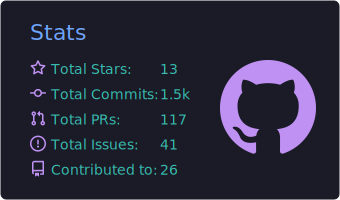
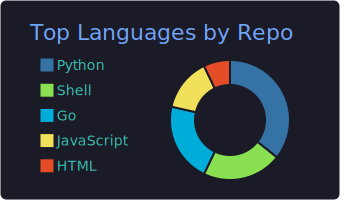

# Me

My name is Mohammed Firdous and I am focused on Cloud Infrastructure, AI, and Kubernetes, with Golang and Python as my primary language.

Email me: mohammedfirdous682[at]gmail dot com

## Tech Stack

## Latest Blog Posts

<!-- BLOG-POST-LIST:START -->
- [MCPs and APIs](https://medium.com/@mohammedfirdousaraoye/mcps-and-apis-6d4d3559da63?source=rss-19706121782c------2)
- [Why a Serverless Mindset Matters](https://medium.com/@mohammedfirdousaraoye/why-a-serverless-mindset-matters-a0103642631a?source=rss-19706121782c------2)
- [Understanding Docker](https://medium.com/@mohammedfirdousaraoye/understanding-docker-fdfc1edf3bbd?source=rss-19706121782c------2)
- [3 Tier Architecture using AWS CloudFormation](https://medium.com/@mohammedfirdousaraoye/3-tier-architecture-using-aws-cloudformation-419044db9587?source=rss-19706121782c------2)
- [Navigating AWS with Confidence: A Beginner’s Guide to Amazon CloudWatch and Amazon Route 53](https://medium.com/@mohammedfirdousaraoye/navigating-aws-with-confidence-a-beginners-guide-to-amazon-cloudwatch-and-amazon-route-53-38e1225cf0f0?source=rss-19706121782c------2)
<!-- BLOG-POST-LIST:END -->

## Recent Activity

<!--START_SECTION:activity-->
1. 🔎 Created PR #6981 in [pipe-cd/pipecd](https://github.com/pipe-cd/pipecd/pull/6981#pullrequestreview-4679950331)
2. ⭐ Starred [liquidslr/leetcode-company-wise-problems](https://github.com/liquidslr/leetcode-company-wise-problems)
3. ⭐ Starred [liquidslr/system-design-notes](https://github.com/liquidslr/system-design-notes)
4. ⭐ Starred [SimplifyJobs/New-Grad-Positions](https://github.com/SimplifyJobs/New-Grad-Positions)
5. 🗣 Commented on PR #6815 in [pipe-cd/pipecd](https://github.com/pipe-cd/pipecd/issues/6815#issuecomment-4950499113)
<!--END_SECTION:activity-->

## GitHub Stats

<table>
  <tr>
    <td>
      
    </td>
    <td>
      
    </td>
  </tr>
</table>

