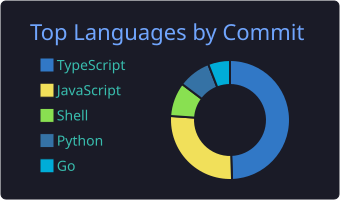
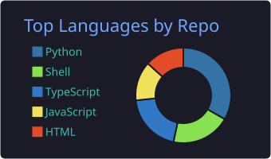

# Me
I work on cloud infrastructure, Kubernetes tooling and build with Go and Python.

Email me: mohammedfirdous682[at]gmail dot com

## Tech Stack

## Latest Blog Posts

<!-- BLOG-POST-LIST:START -->
- [MCPs and APIs](https://medium.com/@mohammedfirdousaraoye/mcps-and-apis-6d4d3559da63?source=rss-19706121782c------2)
- [Why a Serverless Mindset Matters](https://medium.com/@mohammedfirdousaraoye/why-a-serverless-mindset-matters-a0103642631a?source=rss-19706121782c------2)
- [Understanding Docker](https://medium.com/@mohammedfirdousaraoye/understanding-docker-fdfc1edf3bbd?source=rss-19706121782c------2)
- [3 Tier Architecture using AWS CloudFormation](https://medium.com/@mohammedfirdousaraoye/3-tier-architecture-using-aws-cloudformation-419044db9587?source=rss-19706121782c------2)
- [Navigating AWS with Confidence: A Beginner’s Guide to Amazon CloudWatch and Amazon Route 53](https://medium.com/@mohammedfirdousaraoye/navigating-aws-with-confidence-a-beginners-guide-to-amazon-cloudwatch-and-amazon-route-53-38e1225cf0f0?source=rss-19706121782c------2)
<!-- BLOG-POST-LIST:END -->

## Recent Activity

<!--START_SECTION:activity-->
1. ⭐ Starred [timqian/open-source-jobs](https://github.com/timqian/open-source-jobs)
2. 🎉 Created a new branch in a private repository
3. 🍴 Forked [santifer/career-ops](https://github.com/santifer/career-ops)
4. 🔎 Created PR #28 in [mohammedfirdouss/mohammedfirdouss](https://github.com/mohammedfirdouss/mohammedfirdouss/pull/28#pullrequestreview-4888753577)
5. ⭐ Starred [fishaudio/fish-speech](https://github.com/fishaudio/fish-speech)
<!--END_SECTION:activity-->

## GitHub Stats

<table>
  <tr>
    <td>
      
    </td>
    <td>
      
    </td>
  </tr>
</table>

